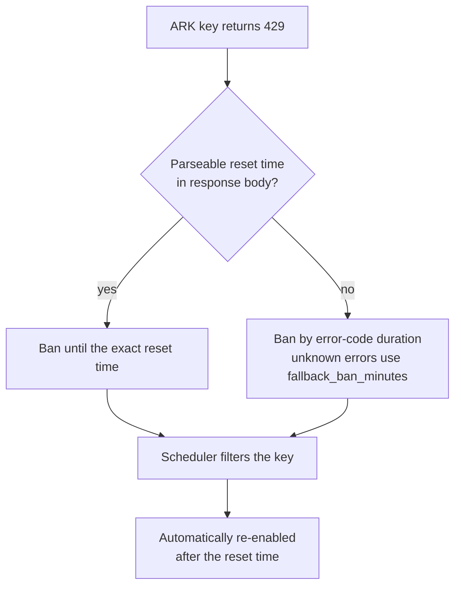

# ark-429-autoban

English | [中文](https://github.com/wyx1818/ark-429-autoban/blob/main/README_CN.md)

A [CLIProxyAPI](https://github.com/router-for-me/CLIProxyAPI) plugin that auto-isolates Volcano Engine ARK API keys on HTTP 429.

When an ARK key returns 429 due to quota exhaustion or server overload, the plugin temporarily removes it from the scheduler candidate pool. The key is automatically re-enabled once its reset time passes.


## Features

- **Precise ban duration**: Parses the exact reset time from ARK's 429 response body (`It will reset at ...`). Falls back to per-error-code durations when no reset time is available.
- **Per-error-code fallback**: `ServerOverloaded` → 5 min, `RateLimitExceeded`/`Throttled`/`RequestLimitExceeded` → 10 min, unknown errors → configurable `fallback_ban_minutes` (default 30 min).
- **Ban only extends, never shortens**: A new 429 with a later reset time extends the ban; an earlier one is ignored. Original `BannedAt` is preserved.
- **Key label auto-compute**: Reads `config.yaml` comments (e.g. `# iaas-app-center-test`) as human-readable labels for the status page—no need to identify keys by hash.
- **Lazy unban**: No timers. Ban expiry is checked on each scheduler pick—past expiry means the key goes back to the pool automatically.
- **Follows CPA routing strategy**: When bans force the plugin to take over scheduling, it runs the same algorithm configured in CPA's `routing.strategy`—`round-robin`, `weighted-round-robin` (smooth WRR with per-key `weight`), or `fill-first`—over the ban-filtered candidate set.
- **Session affinity preserved**: When CPA's `routing.session-affinity` is enabled, the plugin keeps session-to-key bindings (including CPA's derived session IDs, so header-less clients still stick) with the configured `session-affinity-ttl`. A binding whose key gets banned is reselected via the configured strategy.
- **Ban persistence**: Bans are written to `ark-429-autoban-bans.json` (next to the plugin dir) and restored on restart—CPA restarts no longer wipe ban state.
- **Non-intrusive**: Only processes `openai-compatibility` credentials whose Base URL uses `https://ark.cn-beijing.volces.com`. Recognition is purely by Base URL—any provider name works (`ark-code`, `ark-plan`, …), and non-ARK credentials (e.g. OpenRouter) are never touched.
- **Management UI**: Embedded status page at `/v0/resource/plugins/ark-429-autoban/status` with ban list, countdown, key labels, manual unban, and config reload. Dark mode follows the CPA management panel.

## Configuration

| Option | Type | Default | Description |
|--------|------|---------|-------------|
| `config_path` | string | — | Path to CPA's config.yaml. Used to scan ARK providers, Base URLs, API keys, and trailing comments for credential detection and status-page labels. |
| `fallback_ban_minutes` | integer | 30 | Generic ban duration (minutes) for unknown 429 errors without a parseable reset time. Known errors use built-in durations: `ServerOverloaded` 5 min; `RateLimitExceeded`, `Throttled`, `RequestLimitExceeded` 10 min. |

## Usage

### 1. Get the plugin

Use a prebuilt `ark-429-autoban.so`, or build from source (Docker required):

```bash
docker build -t 429builder:latest -f build/Dockerfile .
./build.sh
```

Build output:

```text
dist/ark-429-autoban.so
```

### 2. Install the plugin

Copy the `.so` into the plugin directory configured in CLIProxyAPI, e.g. `/CLIProxyAPI/data/plugins` inside a container:

```bash
cp dist/ark-429-autoban.so /path/to/cpa/data/plugins/
```

If CLIProxyAPI runs in Docker, make sure the host plugin directory is mounted into the container and matches `plugins.dir`.

### 3. Configure CLIProxyAPI

Enable the plugin in CLIProxyAPI's `config.yaml`:

```yaml
plugins:
  dir: /CLIProxyAPI/data/plugins
  enabled: true
  configs:
    ark-429-autoban:
      enabled: true
      priority: 100
      config_path: /CLIProxyAPI/config.yaml
      fallback_ban_minutes: 30  # optional, default 30
```

`config_path` must be readable by the CLIProxyAPI process. The plugin scans every provider in the file's `openai-compatibility:` block; any provider whose Base URL belongs to `https://ark.cn-beijing.volces.com` is recognized as an ARK credential (provider names don't matter—`ark-code`, `ark-plan`, or anything else), and trailing comments on API key lines become human-readable labels on the status page.

The plugin also reads the file's `routing:` block so its takeover scheduling stays consistent with CPA behavior:

```yaml
routing:
  strategy: weighted-round-robin  # round-robin (default) / weighted-round-robin / fill-first
  session-affinity: true          # keep session stickiness while the plugin handles scheduling
  session-affinity-ttl: "1h"      # binding TTL, defaults to 1 hour
```

With `weighted-round-robin`, each key can set a `weight` under `api-key-entries` (default 1, max 1,000,000—same as CPA):

```yaml
openai-compatibility:
  - name: ark-code
    base-url: https://ark.cn-beijing.volces.com/api/coding/v3
    api-key-entries:
      - api-key: *** # account-name
        weight: 2
```

After changing routing settings, use "Reload config" on the status page (or restart CPA)—no need to rebuild the plugin.

Restart CLIProxyAPI so the plugin is loaded.

### 4. View status

Once loaded, open **ARK 429 Autoban** in the CPA management UI, or visit:

```text
/v0/resource/plugins/ark-429-autoban/status
```

The status page supports:

- Viewing currently banned keys (account comment labels; hover the API Key column for the full auth ID, hover the Key column for the masked key)
- Ban reason, reset time, and remaining countdown (auto-refreshes every 30s)
- Manual unban for a single key or all keys
- Reloading `config_path` to refresh labels and routing settings

## How it works



## Verifying the install

After restarting CLIProxyAPI, check in order:

1. Plugin load and registration messages appear in the logs.
2. `/v1/models` still works.
3. The status page opens.
4. A real request confirms scheduling works as before.
5. After an ARK 429, the key appears on the status page and is filtered from subsequent scheduling.

Seeing the plugin load is not enough to prove the full chain works—verify the usage hook and scheduler with real requests.

## Install from the Plugin Store

If your CPA version supports the plugin store, search for `ark-429-autoban` in the CPA management panel.

Or add a custom store source:

```yaml
plugins:
  enabled: true
  store-sources:
    - https://raw.githubusercontent.com/wyx1818/ark-429-autoban/main/registry.json
```

## Known limitations

- **No cross-priority fallback**: If multiple ARK providers use different `priority` values and the highest-priority group is fully banned, CPA's `availableAuthsForRouteModel` never passes lower-priority groups to the plugin. This is a CPA scheduler architecture limitation ([issue #4196](https://github.com/router-for-me/CLIProxyAPI/issues/4196)), not a plugin bug. Prefer equal priorities and use `weight` for tiering.
- **Usage hook is asynchronous**: CPA dispatches usage records via an async queue, so a ban may lag the next scheduler pick. During fast retries the same key may be reselected and hit another 429.
- **CPA's SessionAffinitySelector is bypassed while the plugin handles scheduling**: Excluding banned keys requires the plugin to return `Handled`, so it replicates the routing strategy and session affinity internally. Subtle differences remain: the affinity TTL refreshes at pick time (CPA touches on successful results), and explicit session fields in the request body (`prompt_cache_key`, `session_id`, …) are not visible to the plugin (covered by CPA's derived session ID).

## License

MIT
