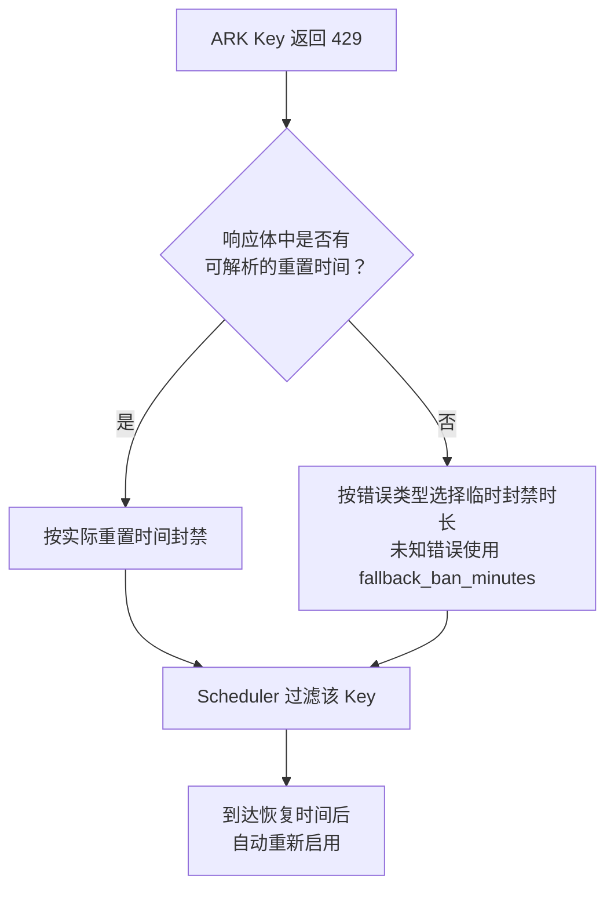

# ark-429-autoban

A [CLIProxyAPI](https://github.com/router-for-me/CLIProxyAPI) plugin that auto-isolates Volcano Engine ARK API keys on HTTP 429.

When an ARK key returns 429 due to quota exhaustion or server overload, the plugin temporarily removes it from the scheduler candidate pool. The key is automatically re-enabled once its reset time passes.


## Features

- **Precise ban duration**: Parses the exact reset time from ARK's 429 response body (`It will reset at ...`). Falls back to per-error-code durations when no reset time is available.
- **Per-error-code fallback**: `ServerOverloaded` → 5 min, `RateLimitExceeded`/`Throttled`/`RequestLimitExceeded` → 10 min, unknown errors → configurable `fallback_ban_minutes` (default 30 min).
- **Ban only extends, never shortens**: A new 429 with a later reset time extends the ban; an earlier one is ignored. Original `BannedAt` is preserved.
- **Key label auto-compute**: Reads `config.yaml` comments (e.g. `# iaas-app-center-test`) as human-readable labels for the status page—no need to identify keys by hash.
- **Lazy unban**: No timers. Ban expiry is checked on each scheduler pick—past expiry means the key goes back to the pool automatically.
- **Follows CPA routing strategy**: When bans force the plugin to take over scheduling, it runs the same algorithm configured in CPA's `routing.strategy`—`round-robin`, `weighted-round-robin` (smooth WRR with per-key `weight`), or `fill-first`—over the ban-filtered candidate set.
- **Session affinity preserved**: When CPA's `routing.session-affinity` is enabled, the plugin keeps session-to-key bindings (including CPA's derived session IDs, so header-less clients still stick) with the configured `session-affinity-ttl`. A binding whose key gets banned is reselected via the configured strategy.
- **Ban persistence**: Bans are written to `ark-429-autoban-bans.json` (next to the plugin dir) and restored on restart—CPA restarts no longer wipe ban state.
- **Non-intrusive**: Only processes `openai-compatibility` credentials whose Base URL uses `https://ark.cn-beijing.volces.com`. Recognition is purely by Base URL—any provider name works (`ark-code`, `ark-plan`, …), and non-ARK credentials (e.g. OpenRouter) are never touched.
- **Management UI**: Embedded status page at `/v0/resource/plugins/ark-429-autoban/status` with ban list, countdown, key labels, manual unban, and config reload. Dark mode follows the CPA management panel.

## 配置项

| 配置项 | 类型 | 默认值 | 说明 |
|--------|------|--------|------|
| `config_path` | string | — | CPA 的 config.yaml 路径，用于自动读取 ARK provider、Base URL、API Key 及行尾注释，识别 ARK 凭证并生成状态页标签。 |
| `fallback_ban_minutes` | integer | 30 | 未知 429 错误且无法解析重置时间时的通用封禁时长（分钟）。已知错误使用内置策略：`ServerOverloaded` 5 分钟，`RateLimitExceeded`、`Throttled`、`RequestLimitExceeded` 10 分钟。 |

## 使用方法

### 1. 获取插件

可以直接使用已编译的 `ark-429-autoban.so`，也可以从源码构建。

源码构建需要 Docker：

```bash
docker build -t 429builder:latest -f build/Dockerfile .
./build.sh
```

编译结果位于：

```text
dist/ark-429-autoban.so
```

### 2. 安装插件

将 `.so` 复制到 CLIProxyAPI 配置的插件目录。下面以容器内目录 `/CLIProxyAPI/data/plugins` 为例：

```bash
cp dist/ark-429-autoban.so /path/to/cpa/data/plugins/
```

如果 CLIProxyAPI 运行在 Docker 中，请确保宿主机插件目录已挂载到容器内，并且与 `plugins.dir` 指向同一位置。

### 3. 配置 CLIProxyAPI

在 CLIProxyAPI 的 `config.yaml` 中启用插件：

```yaml
plugins:
  dir: /CLIProxyAPI/data/plugins
  enabled: true
  configs:
    ark-429-autoban:
      enabled: true
      priority: 100
      config_path: /CLIProxyAPI/config.yaml
      fallback_ban_minutes: 30  # 可选，默认 30
```

`config_path` 必须是 CLIProxyAPI 进程能够读取的配置文件路径。插件会扫描该文件 `openai-compatibility:` 块中的所有 provider，凡 Base URL 属于 `https://ark.cn-beijing.volces.com` 的都识别为 ARK 凭证（不看 provider 名字，`ark-code`、`ark-plan` 等任意命名均可），并读取 API Key 的行尾注释在状态页显示易读标签。

同时，插件会从该文件的 `routing:` 块读取调度配置，使封禁期间的插件接管调度与 CPA 行为保持一致：

```yaml
routing:
  strategy: weighted-round-robin  # round-robin（默认）/ weighted-round-robin / fill-first
  session-affinity: true          # 有 key 被 ban 时插件侧保持会话粘性
  session-affinity-ttl: "1h"      # 粘性绑定 TTL，缺省 1 小时
```

配合 `weighted-round-robin` 时，可在 `api-key-entries` 中为每个 key 配置 `weight`（缺省 1，上限 100 万，与 CPA 一致）：

```yaml
openai-compatibility:
  - name: ark-code
    base-url: https://ark.cn-beijing.volces.com/api/coding/v3
    api-key-entries:
      - api-key: *** # account-name
        weight: 2
```

修改 routing 配置后调用状态页的"重新加载配置"（或重启 CPA）即可生效，无需重新编译插件。

配置完成后重启 CLIProxyAPI，使插件被加载。

### 4. 查看状态

插件加载后，可通过 CPA 管理界面中的 **ARK 429 Autoban** 菜单进入状态页，或者直接访问：

```text
/v0/resource/plugins/ark-429-autoban/status
```

状态页支持：

- 查看当前被封禁的 Key（显示账号注释标签，hover 查看打码密钥）
- 查看封禁原因、恢复时间和剩余时间
- 手动解封单个或全部 Key
- 重新读取 `config_path`，刷新账号标签

## 工作流程



## 验证安装

重启 CLIProxyAPI 后，建议依次检查：

1. 日志中是否出现插件加载和注册成功的信息。
2. `/v1/models` 是否仍能正常访问。
3. 状态页面是否可以打开。
4. 发送一次真实请求，确认原有调度功能正常。
5. 出现 ARK 429 后，确认对应 Key 出现在状态页并被后续调度过滤。

仅看到插件加载成功并不能证明完整链路正常，最好使用真实请求验证 usage hook 和 scheduler。

## Plugin Store 安装

如果 CPA 版本支持插件商店，可以直接在 CPA 管理面板的 Plugin Store 中搜索 `ark-429-autoban` 安装。

也可以手动添加自定义商店源：

```yaml
plugins:
  enabled: true
  store-sources:
    - https://raw.githubusercontent.com/wyx1818/ark-429-autoban/main/registry.json
```

## 已知限制

- **不支持跨 priority fallback**：如果多个 ARK provider 配置了不同 `priority`，高优先级组全部被 ban 时，CPA 的 `availableAuthsForRouteModel` 不会将低优先级组传递给插件。这是 CPA scheduler 架构的限制（[issue #4196](https://github.com/router-for-me/CLIProxyAPI/issues/4196)），非插件 bug。建议相同模型的 ARK provider 使用相同 priority。
- **Usage hook 是异步的**：CPA 通过 usage queue 异步投递 usage record，插件 ban 操作可能滞后于下一次 scheduler pick。在快速 retry 时，同一 key 可能被重复选中触发 429。
- **插件接管调度期间绕过 CPA 的 SessionAffinitySelector**：排除被 ban key 必须让插件返回 `Handled`，因此插件在内部复刻了 routing strategy 和 session affinity 逻辑。与 CPA 原生实现仍有细微差异：粘性 TTL 在 pick 时续期（CPA 在请求成功后 Touch），且请求体中的 `prompt_cache_key`/`session_id` 等显式 session 字段插件不可见（由 CPA 的 derived session ID 兜底）。

## License

MIT
