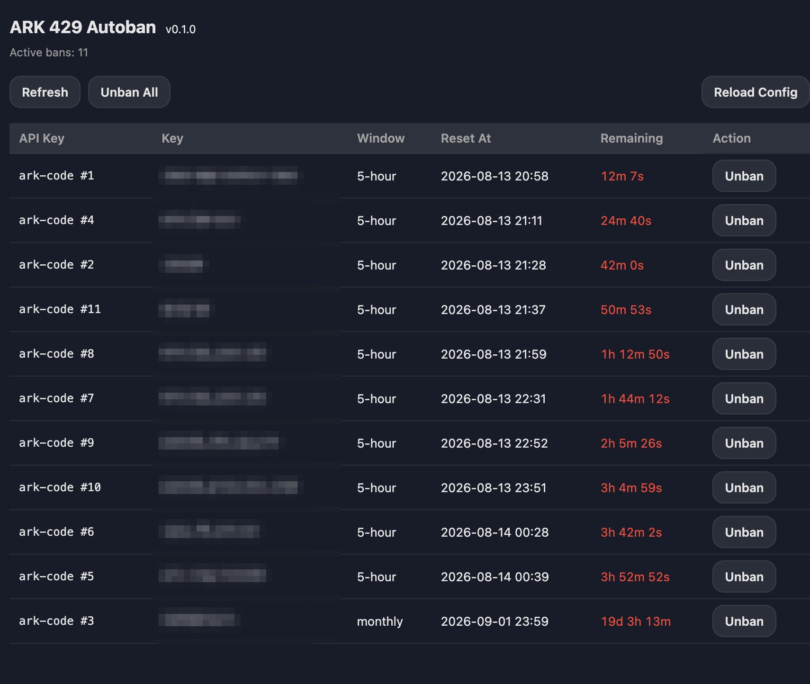
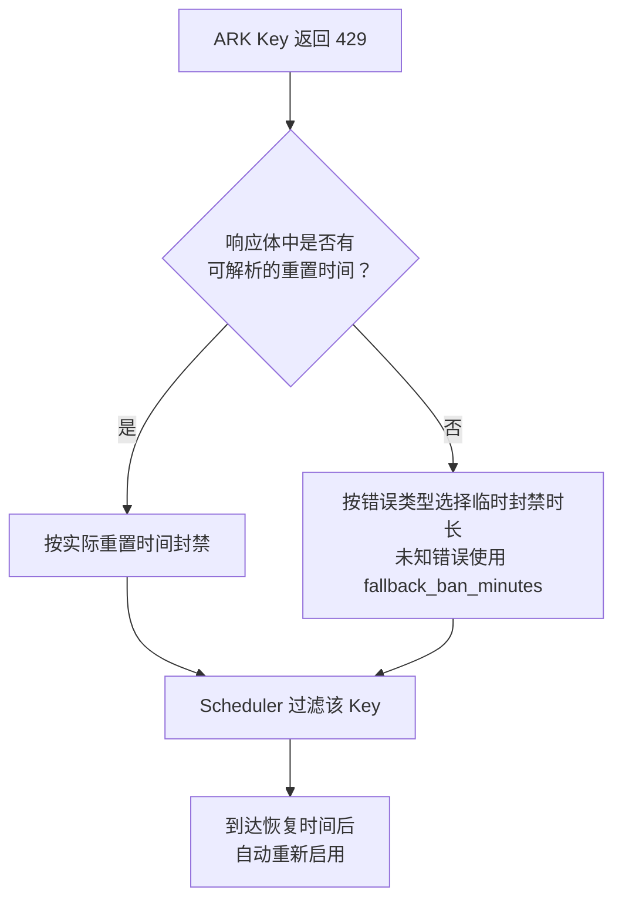

# ark-429-autoban

`ark-429-autoban` 是一个用于 [CLIProxyAPI](https://github.com/router-for-me/CLIProxyAPI) 的 CPA 插件，用来自动隔离返回 HTTP 429 的火山方舟（ARK）API Key。

当某个 ARK Key 因额度耗尽或服务繁忙返回 429 时，插件会暂时将它从调度候选中移除，避免后续请求继续命中同一个不可用 Key。达到恢复时间后，该 Key 会自动重新参与调度。



## 功能

- 只处理 `openai-compatibility` 中 Base URL 使用官方域名 `https://ark.cn-beijing.volces.com` 的凭证，允许 `/api/plan/v3`、`/api/coding/v3` 等路径，不影响其他兼容服务。
- 从 ARK 的 429 响应中解析额度重置时间，并封禁到对应时间。
- 无法解析重置时间时按错误类型临时封禁：`ServerOverloaded` 为 5 分钟，限流类错误为 10 分钟，其他错误使用 `fallback_ban_minutes`（默认 30 分钟）。
- 调度请求时自动过滤仍在封禁期内的 Key。
- 封禁到期后自动恢复，无需手动操作。
- 提供状态页面，可查看封禁列表、剩余时间、账号标签，hover Key 列可查看打码密钥，并手动解封或重新加载配置。
- 没有 Key 被封禁时不接管选择结果，保留 CPA 原有的 Session Affinity 等调度行为。

> 封禁状态保存在内存中，重启 CLIProxyAPI 后会清空。

## 配置项

| 配置项 | 类型 | 默认值 | 说明 |
|--------|------|--------|------|
| `config_path` | string | — | CPA 的 config.yaml 路径，用于自动读取 ARK provider、Base URL、API Key 及行尾注释，识别 ARK 凭证并生成状态页标签。 |
| `fallback_ban_minutes` | integer | 30 | 未知 429 错误且无法解析重置时间时的通用封禁时长（分钟）。已知错误使用内置策略：`ServerOverloaded` 5 分钟，`RateLimitExceeded`、`Throttled`、`RequestLimitExceeded` 10 分钟。 |

## 使用方法

### 1. 获取插件

可以直接使用已编译的 `ark-429-autoban.so`，也可以从源码构建。

源码构建需要 Docker：

```bash
docker build -t 429builder:latest -f build/Dockerfile .
./build.sh
```

编译结果位于：

```text
dist/ark-429-autoban.so
```

### 2. 安装插件

将 `.so` 复制到 CLIProxyAPI 配置的插件目录。下面以容器内目录 `/CLIProxyAPI/data/plugins` 为例：

```bash
cp dist/ark-429-autoban.so /path/to/cpa/data/plugins/
```

如果 CLIProxyAPI 运行在 Docker 中，请确保宿主机插件目录已挂载到容器内，并且与 `plugins.dir` 指向同一位置。

### 3. 配置 CLIProxyAPI

在 CLIProxyAPI 的 `config.yaml` 中启用插件：

```yaml
plugins:
  dir: /CLIProxyAPI/data/plugins
  enabled: true
  configs:
    ark-429-autoban:
      enabled: true
      priority: 100
      config_path: /CLIProxyAPI/config.yaml
      fallback_ban_minutes: 30  # 可选，默认 30
```

`config_path` 必须是 CLIProxyAPI 进程能够读取的配置文件路径。插件会读取该文件中的 ARK provider、Base URL、API Key 及行尾注释，用于识别 ARK 凭证并在状态页显示易读标签。

例如：

```yaml
openai-compatibility:
  - name: ark-code
    base-url: https://ark.cn-beijing.volces.com/api/coding/v3
    api-key-entries:
      - api-key: *** # account-name
```

配置完成后重启 CLIProxyAPI，使插件被加载。

### 4. 查看状态

插件加载后，可通过 CPA 管理界面中的 **ARK 429 Autoban** 菜单进入状态页，或者直接访问：

```text
/v0/resource/plugins/ark-429-autoban/status
```

状态页支持：

- 查看当前被封禁的 Key（显示账号注释标签，hover 查看打码密钥）
- 查看封禁原因、恢复时间和剩余时间
- 手动解封单个或全部 Key
- 重新读取 `config_path`，刷新账号标签

## 工作流程



## 验证安装

重启 CLIProxyAPI 后，建议依次检查：

1. 日志中是否出现插件加载和注册成功的信息。
2. `/v1/models` 是否仍能正常访问。
3. 状态页面是否可以打开。
4. 发送一次真实请求，确认原有调度功能正常。
5. 出现 ARK 429 后，确认对应 Key 出现在状态页并被后续调度过滤。

仅看到插件加载成功并不能证明完整链路正常，最好使用真实请求验证 usage hook 和 scheduler。
