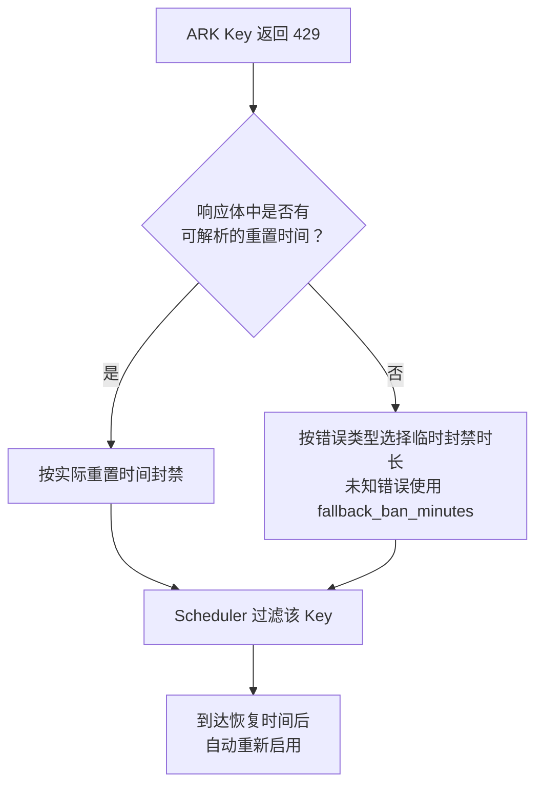

# ark-429-autoban

[English](https://github.com/wyx1818/ark-429-autoban/blob/main/README.md) | 中文

一个 [CLIProxyAPI](https://github.com/router-for-me/CLIProxyAPI) 插件，在 HTTP 429 时自动隔离火山引擎方舟（ARK）的 API Key。

当 ARK key 因配额耗尽或服务过载返回 429 时，插件会暂时把它从调度候选池中移除；到达重置时间后自动恢复。


## 功能特性

- **精确封禁时长**：从 ARK 429 响应体解析准确的重置时间（`It will reset at ...`）；无法解析时按错误类型回退到内置时长。
- **按错误类型回退**：`ServerOverloaded` → 5 分钟，`RateLimitExceeded`/`Throttled`/`RequestLimitExceeded` → 10 分钟，未知错误 → 可配置的 `fallback_ban_minutes`（默认 30 分钟）。
- **封禁只延长不缩短**：新 429 的重置时间更晚则延长封禁，更早则忽略；保留原始封禁时间 `BannedAt`。
- **Key 标签自动计算**：读取 `config.yaml` 行尾注释（如 `# iaas-app-center-test`）作为状态页的易读标签，无需靠 hash 辨认 key。
- **懒解封**：无定时器。每次调度时检查封禁是否过期，过期自动放回候选池。
- **遵循 CPA 调度策略**：当封禁迫使插件接管调度时，在过滤后的候选集上运行与 CPA `routing.strategy` 一致的算法——`round-robin`、`weighted-round-robin`（平滑 WRR，支持 per-key `weight`）或 `fill-first`。
- **保持会话粘性**：开启 CPA 的 `routing.session-affinity` 时，插件在接管调度期间维持 session 到 key 的绑定（包括 CPA 的派生 session ID，不带 session 头的客户端也能粘住），TTL 遵循 `session-affinity-ttl`；绑定的 key 被 ban 时按配置策略重选换绑。
- **封禁持久化**：封禁记录写入 `ark-429-autoban-bans.json`（插件目录旁），重启后自动恢复，不再因 CPA 重启丢失。
- **无侵入**：只处理 Base URL 属于 `https://ark.cn-beijing.volces.com` 的 `openai-compatibility` 凭证。识别纯看 Base URL——provider 名字任意（`ark-code`、`ark-plan`……），非 ARK 凭证（如 OpenRouter）一律不碰。
- **管理界面**：内嵌状态页 `/v0/resource/plugins/ark-429-autoban/status`，含封禁列表、倒计时、Key 标签、手动解封和配置重载；暗色模式跟随 CPA 管理面板。

## 配置项

| 配置项 | 类型 | 默认值 | 说明 |
|--------|------|--------|------|
| `config_path` | string | — | CPA 的 config.yaml 路径，用于扫描 ARK provider、Base URL、API Key 及行尾注释，识别 ARK 凭证并生成状态页标签。 |
| `fallback_ban_minutes` | integer | 30 | 未知 429 错误且无法解析重置时间时的通用封禁时长（分钟）。已知错误使用内置策略：`ServerOverloaded` 5 分钟，`RateLimitExceeded`、`Throttled`、`RequestLimitExceeded` 10 分钟。 |

## 使用方法

### 1. 获取插件

可以直接使用已编译的 `ark-429-autoban.so`，也可以从源码构建（需要 Docker）：

```bash
docker build -t 429builder:latest -f build/Dockerfile .
./build.sh
```

编译结果位于：

```text
dist/ark-429-autoban.so
```

### 2. 安装插件

将 `.so` 复制到 CLIProxyAPI 配置的插件目录。下面以容器内目录 `/CLIProxyAPI/data/plugins` 为例：

```bash
cp dist/ark-429-autoban.so /path/to/cpa/data/plugins/
```

如果 CLIProxyAPI 运行在 Docker 中，请确保宿主机插件目录已挂载到容器内，并且与 `plugins.dir` 指向同一位置。

### 3. 配置 CLIProxyAPI

在 CLIProxyAPI 的 `config.yaml` 中启用插件：

```yaml
plugins:
  dir: /CLIProxyAPI/data/plugins
  enabled: true
  configs:
    ark-429-autoban:
      enabled: true
      priority: 100
      config_path: /CLIProxyAPI/config.yaml
      fallback_ban_minutes: 30  # 可选，默认 30
```

`config_path` 必须是 CLIProxyAPI 进程能够读取的配置文件路径。插件会扫描该文件 `openai-compatibility:` 块中的所有 provider，凡 Base URL 属于 `https://ark.cn-beijing.volces.com` 的都识别为 ARK 凭证（不看 provider 名字，`ark-code`、`ark-plan` 等任意命名均可），并读取 API Key 的行尾注释在状态页显示易读标签。

同时，插件会从该文件的 `routing:` 块读取调度配置，使封禁期间的插件接管调度与 CPA 行为保持一致：

```yaml
routing:
  strategy: weighted-round-robin  # round-robin（默认）/ weighted-round-robin / fill-first
  session-affinity: true          # 有 key 被 ban 时插件侧保持会话粘性
  session-affinity-ttl: "1h"      # 粘性绑定 TTL，缺省 1 小时
```

配合 `weighted-round-robin` 时，可在 `api-key-entries` 中为每个 key 配置 `weight`（缺省 1，上限 100 万，与 CPA 一致）：

```yaml
openai-compatibility:
  - name: ark-code
    base-url: https://ark.cn-beijing.volces.com/api/coding/v3
    api-key-entries:
      - api-key: *** # account-name
        weight: 2
```

修改 routing 配置后调用状态页的"重新加载配置"（或重启 CPA）即可生效，无需重新编译插件。

配置完成后重启 CLIProxyAPI，使插件被加载。

### 4. 查看状态

插件加载后，可通过 CPA 管理界面中的 **ARK 429 Autoban** 菜单进入状态页，或者直接访问：

```text
/v0/resource/plugins/ark-429-autoban/status
```

状态页支持：

- 查看当前被封禁的 Key（显示账号注释标签；hover API Key 列查看完整 auth ID，hover Key 列查看打码密钥）
- 查看封禁原因、恢复时间和剩余时间（每 30 秒自动刷新）
- 手动解封单个或全部 Key
- 重新读取 `config_path`，刷新标签和调度配置

## 工作流程



## 验证安装

重启 CLIProxyAPI 后，建议依次检查：

1. 日志中是否出现插件加载和注册成功的信息。
2. `/v1/models` 是否仍能正常访问。
3. 状态页面是否可以打开。
4. 发送一次真实请求，确认原有调度功能正常。
5. 出现 ARK 429 后，确认对应 Key 出现在状态页并被后续调度过滤。

仅看到插件加载成功并不能证明完整链路正常，最好使用真实请求验证 usage hook 和 scheduler。

## Plugin Store 安装

如果 CPA 版本支持插件商店，可以直接在 CPA 管理面板的 Plugin Store 中搜索 `ark-429-autoban` 安装。

也可以手动添加自定义商店源：

```yaml
plugins:
  enabled: true
  store-sources:
    - https://raw.githubusercontent.com/wyx1818/ark-429-autoban/main/registry.json
```

## 已知限制

- **不支持跨 priority fallback**：如果多个 ARK provider 配置了不同 `priority`，高优先级组全部被 ban 时，CPA 的 `availableAuthsForRouteModel` 不会将低优先级组传递给插件。这是 CPA scheduler 架构的限制（[issue #4196](https://github.com/router-for-me/CLIProxyAPI/issues/4196)），非插件 bug。建议各 provider 使用相同 priority，用 `weight` 表达分层。
- **Usage hook 是异步的**：CPA 通过 usage queue 异步投递 usage record，插件 ban 操作可能滞后于下一次 scheduler pick。在快速 retry 时，同一 key 可能被重复选中触发 429。
- **插件接管调度期间绕过 CPA 的 SessionAffinitySelector**：排除被 ban key 必须让插件返回 `Handled`，因此插件在内部复刻了 routing strategy 和 session affinity 逻辑。与 CPA 原生实现仍有细微差异：粘性 TTL 在 pick 时续期（CPA 在请求成功后 Touch），且请求体中的 `prompt_cache_key`/`session_id` 等显式 session 字段插件不可见（由 CPA 的 derived session ID 兜底）。

## License

MIT
